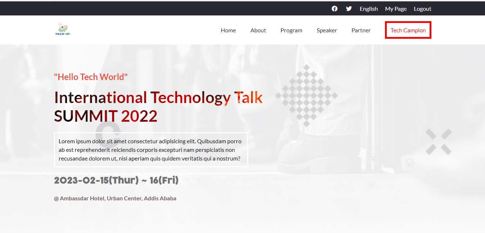

# Tech Talk

> This where we announce the up comming tech talk presenter and store their story link here.

Additional description about the project and its features.

## Built With

- Major languages: `CSS-3`, `HTML-5`, and `JS ES6`
- Frameworks: _none_
- Technologies used: **FIGMA**, **ESLINT**, **STYLELINT**, and **GitHub CI/CD**

## Live Demo
[Live Video Link](https://www.loom.com/share/860663e593f8499c9a36477aad29397b)
[Live Demo Link](https://bushmusi.github.io/tech-talk/)

## Getting Started

To get a local copy up and running follow these simple example steps.

### Prerequisites

The basic requirements for building the executable are:
1. A working browser application (Google chrome, Mozilla Fire fox, Microsoft edge ...)
2. VSCode or any other equivalent code editor
3. Node Package Manager (For installing packages like Lighthous, webhint & stylelint used for checking for debugging bad codes before deployment)

### Setup

1. Clone this project to your local repository

- `git clone https://github.com/bushmusi/tech-talk`

2. Getting pkg and debugging tools
- _Initialise pkg_
- `npm init`

_Install style debugger tool_
- `npm install --save-dev stylelint@13.x stylelint-scss@3.x stylelint-config-standard@21.x stylelint-csstree-validator@1.x`
_If you want to check your style run below command_
- `npx stylelint "**/*.{css,scss}"`

- _Web SEO and debugging tool_
- `npm install --save-dev hint@6.x`
- _If you want to check your page_
- `npx hint .`

- _Install JS debugger_
- `npm install --save-dev eslint@7.x eslint-config-airbnb-base@14.x eslint-plugin-import@2.x babel-eslint@10.x`
- _Check your js code_
- `npx eslint .`

### Run tests

1. Open your terminal from project dir
2. Run: `npm test`

## Authors

👤 **Author1**

- GitHub: [@githubhandle](https://github.com/bushmusi)
- Twitter: [@twitterhandle](https://twitter.com/busher_mestofa)
- LinkedIn: [LinkedIn](https://linkedin.com/in/bushra-mustofa-2620671b7/)

## 🤝 Contributing

Contributions, issues, and feature requests are welcome!

Feel free to check the [issues page](../../issues/).

## Show your support

Give a ⭐️ if you like this project!

## Acknowledgments

- Thanks to [Cindy Shin](https://www.behance.net/adagio07) whose design of cc global summit 2015 was used
- Inspiration
- etc

## 📝 License

This project is [MIT](./MIT.md) licensed.
